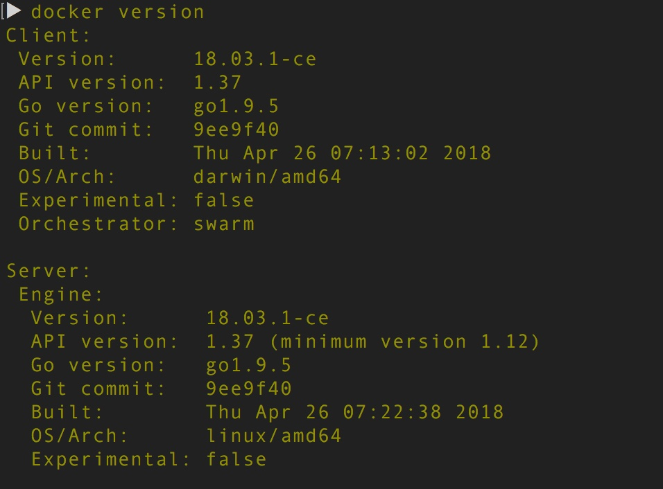
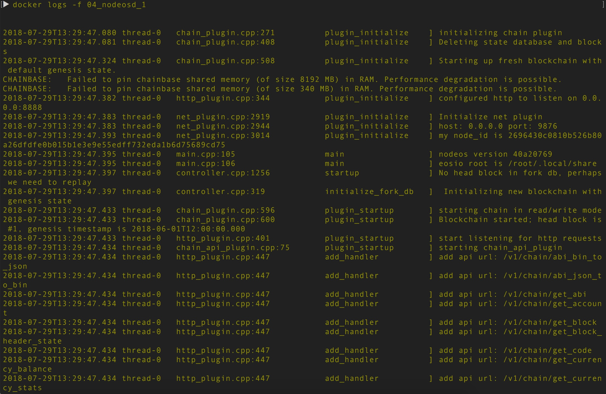

**01-EOS单节点测试网络**
----------------------------------------------
由于EOS的版本在不断的更新迭代，本地编译最新版本的方式更新比较繁琐，而且容易出问题。

因此，我们推荐使用Docker容器的方式配置EOS本地测试环境，这样方便维护升级，而且简单。
此外，EOS的Docker Image会每天定时更新并被推送到[dockerhub](https://hub.docker.com/)，可以直接去拉取官方的最新版本Image使用。

下面的步骤会以Mac系统为例，由于我们使用Docker环境，理论上不依赖具体的操作系统环境，只要使用的系统能够安装Docker即可。

**系统配置要求**：
* 硬盘存储空间 > 8GB
* 内存 > 4GB

1. **安装docker和docker-compose**

可以到[Docker官方网站](https://www.docker.com/community-edition)下载Docker，推荐以下版本:

下载安装后，启动Docker服务，不同的系统启动Docker服务方式不同，请具体查看启动方式。
确认docker安装成功并且docker服务启动之后，再继续进行下一步。

不熟悉Docker的同学，可以去查一下Docker的简单命令介绍，这里我们给出CentOS下面常用的命令：
```Bash
yum install docker  安装服务
systemctl start docker.service 启动服务
systemctl enable docker.service 开机启动服务
docker pull centos 下载映像到本地
docker images centos 查看映像列表
docker run -i -t centos /bin/bash 以交互式启动容器
docker run centos echo 'Hello World'
```
其他参考资料：[docker 命令](https://docs.docker.com/engine/reference/commandline/docker/#child-commands)

如果使用的是Mac系统版本的Docker，docker-compose会跟随docker一起被安装。
如果使用的是CentOS等其他Linux系统，需要单独安装docker-compose，[参考安装](https://docs.docker.com/compose/install/#uninstallation)：
```Bash
sudo curl -L https://github.com/docker/compose/releases/download/1.22.0/docker-compose-$(uname -s)-$(uname -m) -o /usr/local/bin/docker-compose

sudo chmod +x /usr/local/bin/docker-compose

docker-compose --version
```

推荐的docker-compose版本是：(docker-compose的版本差异影响并不大，安装新版本即可)
```Bash
$docker-compose -v
docker-compose version 1.21.2, build a133471
```

2. **获得eos的Docker Image**

eos的Docker Image 有多种版本，适应于不同的应用场景：
* eosio/builder : 包含编译eos的所有依赖库，是eos编译的一个完整环境，这样开发者就无需安装各种工具和依赖库，准备eos的编译环境了。
* eosio/eos : 主网节点使用，比较轻量级，镜像中不包含编译智能合约的依赖库。
* eosio/eos-dev : 适用于开发者的定制环境，其中包含编译智能合约需要的相关工具和依赖库。

其中eosio/eos 和 eosio/eos-dev 都是继承了 eosio/builder 然后编译出来的定制化镜像。
由于我们是开发者，因此我们选用eosio/eos-dev 这个Image。
当然，如果大家只是想启动一个节点，加入主网中，可以直接使用eosio/eos，这个我们在后面会详细介绍。

根据前面的介绍，这里大家可以直接从[官方](https://hub.docker.com/r/eosio/eos-dev/tags/)拉取Image:
```Bash
docker pull eosio/eos-dev:v1.0.8

docker tag eosio/eos-dev:v1.0.8 eosio/eos-dev:latest
```

此外，也可以自己获取eos最新代码之后，在本地使用Dockerfile build出eos-dev Image，
进入eos/Docker/dev目录，执行：
```Bash
docker build . -t eosio/eos-dev:latest
```
**注意**
>>如果不对eos/Docker/dev/Dockerfile 做修改的情况下，使用的事master分支的代码构建的Image，如果想制定release的版本，可以参考我们给出的[Dockerfile样例](./dev/Dockerfile)


3. **启动本地节点的测试环境**

创建volume，供nodeos和keosd挂载使用:
```Bash
docker volume create --name=local-nodeos-data-volume

docker volume create --name=local-keosd-data-volume
```

在blockchain/eos/04/docker目录下，启动nodeos和keosd：
```Bash
docker-compose -f docker-compose-local-eosio1.0.yaml up -d
```
可以查看log日志：
```Bash
docker logs -f docker_nodeosd_1
```
得到如下类似日志：
 


4. **给cleos命令配置alias**

由于我们不希望每次执行cleos命令都进入docker container中执行，因此我们配置了简短的cleos的alias来代替docker命令：
```Bash
alias cleos='docker-compose -f docker-compose-local-eosio1.0.yaml exec keosd /opt/eosio/bin/cleos -u http://nodeosd:8888 --wallet-url http://localhost:8900'
```
(可以将此alias的定义添加到~/.bash_profile 中，这样每次终端启动时候都会自动定义alias)
测试cleos命令是否可用：
```Bash
cleos get info
```

**注意**
>以后cleos命令的执行必须在docker-compose-local-eosio1.0.yaml文件所在目录才可以。

此时也可以通过http的请求，直接访问查询：
```Bash
curl http://localhost:8888/v1/chain/get_info
```


5. **创建Wallet和Keys**

**注意**
>以下命令的执行结果都需要记录备份，以后会用到其中的Wallet密码、私钥以及公钥地址

* 创建Wallet：
```Bash
$cleos wallet create

Creating wallet: default
Save password to use in the future to unlock this wallet.
Without password imported keys will not be retrievable.
"#######################PASSWORD######################"
```

如果一个Wallet不够用，可以再创建新的Wallet：
```Bash
$cleos wallet create -n 2ndWallet

Creating wallet: 2ndWallet
Save password to use in the future to unlock this wallet.
Without password imported keys will not be retrievable.
"#######################PASSWORD######################"
```
**注意**：解锁非默认钱包时候需要加-n参数：
```Bash
cleos wallet unlock -n 2ndWallet 
```

* 创建第一个密钥对(OwnerKey)
```Bash
$cleos create key   # OwnerKey 
Private key: XXXXXXXXXXXXXXXXXXXXXXXXXXXXXXXXXXXXXXXXXXXXXXXXXXX
Public key: EOS8eHNwPjCvcQRnUP1feykKmKexWkRz5zXznK3GTJFPibut7kiaM
```

* 创建第二个密钥对(ActiveKey)
```Bash
$cleos create key   # ActiveKey

Private key: XXXXXXXXXXXXXXXXXXXXXXXXXXXXXXXXXXXXXXXXXXXXXXXXXXX
Public key: EOS7UN5ZY6WYpVhjkjPG4bh5rQxHgAeFKnjLBNok22cATD82JPjai
```

* 检查当前Wallet包含的Keys
```Bash
$cleos wallet keys

[
  "EOS6MRyAjQq8ud7hVNYcfnVPJqcVpscN5So8BhtHuGYqET5GDW5CV",
  "EOS7UN5ZY6WYpVhjkjPG4bh5rQxHgAeFKnjLBNok22cATD82JPjai",
  "EOS8eHNwPjCvcQRnUP1feykKmKexWkRz5zXznK3GTJFPibut7kiaM"
]
```
同样可以同时查询公钥、私钥，但是需要Wallet密码：
```Bash
cleos wallet private_keys
```

6. **备份Wallet**

Wallet文件在哪里？
进入keosd的container：
```Bash
docker exec -it docker_keosd_1 bash
```
进入Wallet文件所在目录：
```Bash
cd /opt/eosio/bin/data-dir
```
查看此目录：
```Bash
$ls
2ndWallet.wallet  default.wallet
```
因此可以在宿主机器使用docker cp命令导出wallet文件了。
此备份文件本身是经过加密的，感兴趣同学可以学习使用eosjs-ecc离线单独完成解密，而不需要依赖Wallet，请[参考](https://github.com/EOSIO/eosjs-ecc/issues/10)。

7. **创建账户(Account)**

创建一个账户叫做token 使用上面定义的两个公钥分别做OwnerKey和ActiveKey：
```Bash
cleos create account eosio token EOS8eHNwPjCvcQRnUP1feykKmKexWkRz5zXznK3GTJFPibut7kiaM EOS7UN5ZY6WYpVhjkjPG4bh5rQxHgAeFKnjLBNok22cATD82JPjai
```
执行的正常输出类似如下：
```Bash
executed transaction: cc1f8d2f1798160e6faf5f18f61ec86e98ae78b6d47d1c19b1580bd75f777582  200 bytes  7297 us
#         eosio <= eosio::newaccount            {"creator":"eosio","name":"token","owner":{"threshold":1,"keys":[{"key":"EOS8eHNwPjCvcQRnUP1feykKmKe...
warning: transaction executed locally, but may not be confirmed by the network yet
```

**注意**
>如果执行以上create account命令可能遇到如下错误：
```Bash
Error:
Error 3090003: provided keys, permissions, and delays do not satisfy declared authorizations
Ensure that you have the related private keys inside your wallet and your wallet is unlocked.
```

此error 需要 import config.ini 中默认的eosio签名账户private key：
```Bash
cleos wallet import 5KQwrPbwdL6PhXujxW37FSSQZ1JiwsST4cqQzDeyXtP79zkvFD3
```
然后再重新执行create account的命令即可。
**原因**：eosio是authorizing account（授权帐户）。 在区块链上执行的操作必须使用与eosio帐户关联的密钥对进行签名。 eosio帐户是用于引导EOSIO节点的特殊帐户。

查看刚创建的账户：
```Bash
cleos get account token --json
```

同样可以查看主账户eosio：
```Bash
cleos get account eosio --json
```

关于以上内容，EOS官方最近也给出[教程](https://developers.eos.io/eosio-nodeos/docs/learn-about-wallets-keys-and-accounts-with-cleos)可供参考（不使用docker）。

**01-启动连接主网的节点**
----------------------------------------------

使用docker-compose-main-net-v1.0.5.yaml文件启动节点，注意此文件依赖：[genesis.json](./genesis.json) 和 [config-main-net.ini](./config-main-net.ini)文件。

启动连接主网的节点：
```Bash
docker-compose -f docker-compose-main-net-v1.0.5.yaml up -d
```
注意cleos的alias稍有变化：
```Bash
alias cleos='docker-compose -f docker-compose-main-net-v1.0.5.yaml exec keosd /opt/eosio/bin/cleos -u http://nodeosd:8888 --wallet-url http://localhost:8900'
```
**注意**：以上启动的节点中使用的Keys是公开的测试账户，私钥已经暴露，十分不安全，仅作为学习、实验参考。同样万不可导入个人真实私钥去连接主网，或启动节点！谨记！

**01-使用已存在的超级节点**
----------------------------------------------
同样启动keosd，使用docker-compose-main-net-v1.0.5.yaml即可。
注意下面将cleos命令中的 http://nodeosd:8888 替换成了某个超级节点的地址http://40.114.68.16:8888
```Bash
alias cleos='docker-compose -f docker-compose-main-net-v1.0.5.yaml exec keosd /opt/eosio/bin/cleos -u http://40.114.68.16:8888 --wallet-url http://localhost:8900'
```

**主网超级节点,查看网址**: [https://eosnodes.privex.io/](https://eosnodes.privex.io/)

**注意**：一定要注意选择安全的前21个超级节点，此外这样使用的安全性仍有待验证，大家可以使用超级节点来做查询，不要通过此方式提交任何交易。


